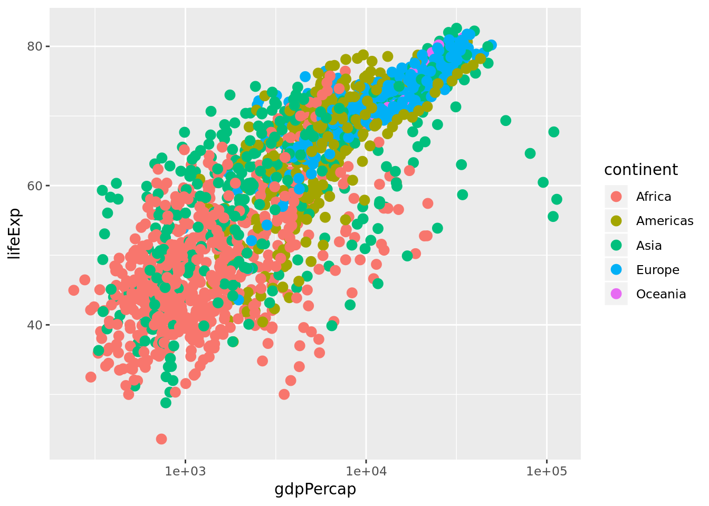
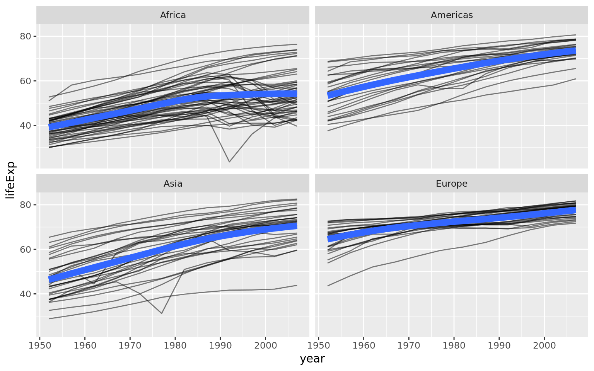
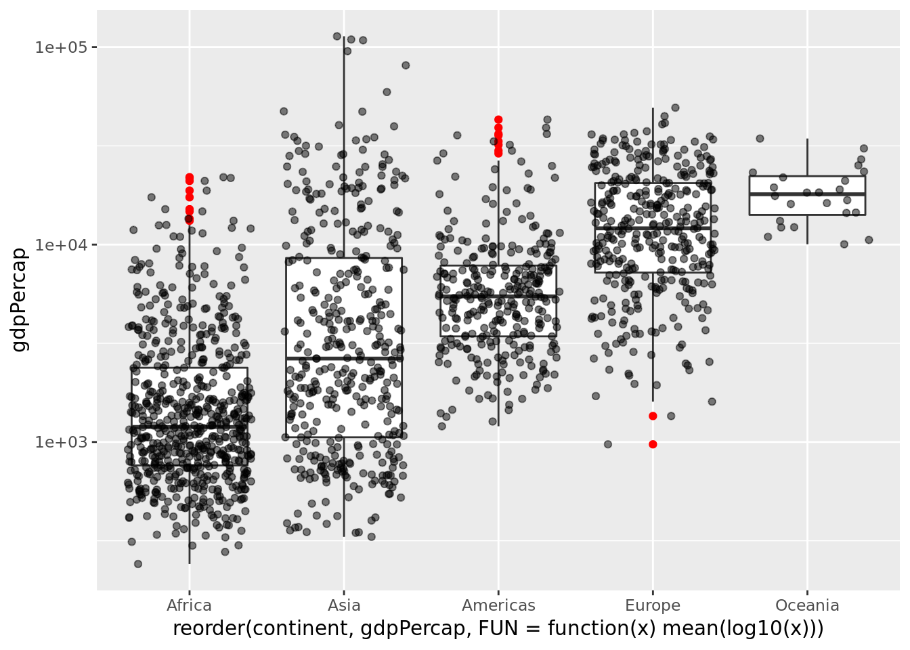
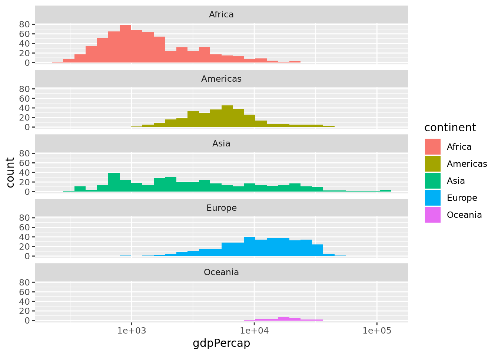

```{r setup, include=FALSE}
knitr::opts_chunk$set(echo = TRUE)
```

## Data Manipulation

### Exercise 1

1. Display the data where the gene ontology biological process (the `bp` variable) is "leucine biosynthesis" (case-sensitive) _and_ the limiting nutrient was Leucine. (Answer should return a 24-by-7 data frame -- 4 genes $\times$ 6 growth rates).
1. Gene/rate combinations had high expression (in the top 1% of expressed genes)? _Hint:_ see `?quantile` and try `quantile(ydat$expression, probs=.99)` to see the expression value which is higher than 99% of all the data, then `filter()` based on that. Try wrapping your answer with a `View()` function so you can see the whole thing. What does it look like those genes are doing? Answer should return a 1971-by-7 data frame.

### Exercise 2

1. First, re-run the command you used above to filter the data for genes involved in the "leucine biosynthesis" biological process _and_ where the limiting nutrient is Leucine. 
2. Wrap this entire filtered result with a call to `arrange()` where you'll arrange the result of #1 by the gene symbol.
3. Wrap this entire result in a `View()` statement so you can see the entire result.

### Exercise 3

Here's a warm-up round. Try the following.

Show the limiting nutrient and expression values for the gene ADH2 when the growth rate is restricted to 0.05. _Hint:_ 2 pipes: `filter` and `select`.


```
## Source: local data frame [6 x 2]
## 
##    nutrient expression
##       (chr)      (dbl)
## 1   Glucose       6.28
## 2   Ammonia       0.55
## 3 Phosphate      -4.60
## 4   Sulfate      -1.18
## 5   Leucine       4.15
## 6    Uracil       0.63
```

What are the four most highly expressed genes when the growth rate is restricted to 0.05 by restricting glucose? Show only the symbol, expression value, and GO terms. _Hint:_ 4 pipes: `filter`, `arrange`, `head`, and `select`.


```
## Source: local data frame [4 x 4]
## 
##   symbol expression                  bp                             mf
##    (chr)      (dbl)               (chr)                          (chr)
## 1   ADH2       6.28       fermentation* alcohol dehydrogenase activity
## 2  HSP26       5.86 response to stress*       unfolded protein binding
## 3   MLS1       5.64    glyoxylate cycle       malate synthase activity
## 4   HXT5       5.56    hexose transport  glucose transporter activity*
```

When the growth rate is restricted to 0.05, what is the average expression level across all genes in the "response to stress" biological process, separately for each limiting nutrient? What about genes in the "protein biosynthesis" biological process? _Hint:_ 3 pipes: `filter`, `group_by`, `summarize`.


```
## Source: local data frame [6 x 2]
## 
##    nutrient   meanexp
##       (chr)     (dbl)
## 1   Ammonia 0.9426667
## 2   Glucose 0.7426667
## 3   Leucine 0.8106667
## 4 Phosphate 0.9806667
## 5   Sulfate 0.7430769
## 6    Uracil 0.7313333
```

```
## Source: local data frame [6 x 2]
## 
##    nutrient    meanexp
##       (chr)      (dbl)
## 1   Ammonia -1.6133514
## 2   Glucose -0.6911351
## 3   Leucine -0.5735676
## 4 Phosphate -0.7496216
## 5   Sulfate -0.9134807
## 6    Uracil -0.8799454
```

### Exercise 4

That was easy, right? How about some tougher ones.

First, some review. How do we see the number of distinct values of a variable? Use `n_distinct()` within a `summarize()` call.


```r
ydat %>% summarize(n_distinct(mf))
```

```
## Source: local data frame [1 x 1]
## 
##   n_distinct(mf)
##            (int)
## 1           1086
```

Which 10 biological process annotations have the most genes associated with them? What about molecular functions? _Hint:_ 4 pipes: `group_by`, `summarize` with `n_distinct`, `arrange`, `head`.


```
## Source: local data frame [10 x 2]
## 
##                                                              bp     n
##                                                           (chr) (int)
## 1                                    biological process unknown   269
## 2                                          protein biosynthesis   182
## 3                           protein amino acid phosphorylation*    78
## 4                                         protein biosynthesis*    73
## 5                        cell wall organization and biogenesis*    64
## 6  regulation of transcription from RNA polymerase II promoter*    49
## 7                        nuclear mRNA splicing, via spliceosome    47
## 8                                                   DNA repair*    44
## 9                                          aerobic respiration*    42
## 10                                       ER to Golgi transport*    42
```

```
## Source: local data frame [10 x 2]
## 
##                                        mf     n
##                                     (chr) (int)
## 1              molecular function unknown   886
## 2      structural constituent of ribosome   185
## 3                         protein binding   107
## 4                             RNA binding    63
## 5                        protein binding*    53
## 6                            DNA binding*    44
## 7            structural molecule activity    43
## 8                         GTPase activity    40
## 9  structural constituent of cytoskeleton    39
## 10          transcription factor activity    38
```

How many distinct genes are there where we know what process the gene is involved in but we don't know what it does? _Hint:_ 3 pipes; `filter` where `bp!="biological process unknown" & mf=="molecular function unknown"`, and after `select`ing columns of interest, pipe the output to `distinct()`. The answer should be **737**, and here are a few:


```
## Source: local data frame [737 x 3]
## 
##    symbol                                                              bp
##     (chr)                                                           (chr)
## 1    SFB2                                           ER to Golgi transport
## 2    EDC3                           deadenylylation-independent decapping
## 3    PER1                                   response to unfolded protein*
## 4   PEX25                         peroxisome organization and biogenesis*
## 5    BNI5                                                    cytokinesis*
## 6   CSN12 adaptation to pheromone during conjugation with cellular fusion
## 7   SEC39                                               secretory pathway
## 8    ABC1                                         ubiquinone biosynthesis
## 9   PRP46                          nuclear mRNA splicing, via spliceosome
## 10   MAM3                      mitochondrion organization and biogenesis*
## ..    ...                                                             ...
## Variables not shown: mf (chr)
```

When the growth rate is restricted to 0.05 by limiting Glucose, which biological processes are the most upregulated? Show a sorted list with the most upregulated BPs on top, displaying the biological process and the average expression of all genes in that process rounded to two digits. _Hint:_ 5 pipes: `filter`, `group_by`, `summarize`, `mutate`, `arrange`.


```
## Source: local data frame [881 x 2]
## 
##                                               bp meanexp
##                                            (chr)   (dbl)
## 1                                  fermentation*    6.28
## 2                               glyoxylate cycle    5.29
## 3  oxygen and reactive oxygen species metabolism    5.04
## 4                            fumarate transport*    5.03
## 5                       acetyl-CoA biosynthesis*    4.32
## 6                                gluconeogenesis    3.64
## 7                      fatty acid beta-oxidation    3.57
## 8                              lactate transport    3.48
## 9                           carnitine metabolism    3.30
## 10                           alcohol metabolism*    3.25
## ..                                           ...     ...
```

Group the data by limiting nutrient (primarily) then by biological process. Get the average expression for all genes annotated with each process, separately for each limiting nutrient, where the growth rate is restricted to 0.05. Arrange the result to show the most upregulated processes on top. The initial result will look like the result below. Pipe this output to a `View()` statement. What's going on? Why didn't the `arrange()` work? _Hint:_ 5 pipes: `filter`, `group_by`, `summarize`, `arrange`, `View`.


```
## Source: local data frame [5,257 x 3]
## Groups: nutrient [6]
## 
##    nutrient                     bp meanexp
##       (chr)                  (chr)   (dbl)
## 1   Ammonia   allantoate transport  6.6400
## 2   Ammonia  amino acid transport*  6.6400
## 3   Ammonia    allantoin transport  5.5600
## 4   Ammonia    proline catabolism*  5.1400
## 5   Ammonia         urea transport  5.1400
## 6   Ammonia asparagine catabolism*  4.7325
## 7   Ammonia  allantoin catabolism*  4.4400
## 8   Ammonia      peptide transport  3.9200
## 9   Ammonia       glyoxylate cycle  3.9100
## 10  Ammonia   sodium ion transport  3.2650
## ..      ...                    ...     ...
```

Let's try to further process that result to get only the top three most upregulated biolgocal processes for each limiting nutrient. Google search "dplyr first result within group." You'll need a `filter(row_number()......)` in there somewhere. _Hint:_ 5 pipes: `filter`, `group_by`, `summarize`, `arrange`, `filter(row_number()...`. _Note:_ dplyr's pipe syntax used to be `%.%` before it changed to `%>%`. So when looking around, you might still see some people use the old syntax. Now if you try to use the old syntax, you'll get a deprecation warning.


```
## Source: local data frame [18 x 3]
## Groups: nutrient [6]
## 
##     nutrient                                            bp meanexp
##        (chr)                                         (chr)   (dbl)
## 1    Ammonia                          allantoate transport   6.640
## 2    Ammonia                         amino acid transport*   6.640
## 3    Ammonia                           allantoin transport   5.560
## 4    Glucose                                 fermentation*   6.280
## 5    Glucose                              glyoxylate cycle   5.285
## 6    Glucose oxygen and reactive oxygen species metabolism   5.040
## 7    Leucine                                 fermentation*   4.150
## 8    Leucine                           fumarate transport*   3.720
## 9    Leucine                              glyoxylate cycle   3.650
## 10 Phosphate               glycerophosphodiester transport   6.640
## 11 Phosphate                vacuole fusion, non-autophagic   4.195
## 12 Phosphate         regulation of cell redox homeostasis*   4.030
## 13   Sulfate                        protein ubiquitination   3.400
## 14   Sulfate                           fumarate transport*   3.270
## 15   Sulfate                 sulfur amino acid metabolism*   2.690
## 16    Uracil                           fumarate transport*   4.320
## 17    Uracil                         pyridoxine metabolism   3.110
## 18    Uracil                        asparagine catabolism*   3.060
```

There's a slight problem with the examples above. We're getting the average expression of all the biological processes separately by each nutrient. But some of these biological processes only have a single gene in them! If we tried to do the same thing to get the correlation between rate and expression, the calculation would work, but we'd get a warning about a standard deviation being zero. The correlation coefficient value that results is `NA`, i.e., missing. While we're summarizing the correlation between rate and expression, let's also show the number of distinct genes within each grouping.


```r
ydat %>% 
  group_by(nutrient, bp) %>% 
  summarize(r=cor(rate, expression), ngenes=n_distinct(symbol))
```

```
## Warning in cor(c(0.05, 0.05, 0.05, 0.05, 0.05, 0.05, 0.05, 0.05, 0.05,
## 0.05, : the standard deviation is zero
```

```
## Source: local data frame [5,286 x 4]
## Groups: nutrient [?]
## 
##    nutrient                                      bp           r ngenes
##       (chr)                                   (chr)       (dbl)  (int)
## 1   Ammonia             'de novo' IMP biosynthesis*  0.31247162      8
## 2   Ammonia  'de novo' pyrimidine base biosynthesis -0.04817745      3
## 3   Ammonia 'de novo' pyrimidine base biosynthesis*  0.16699596      4
## 4   Ammonia       35S primary transcript processing  0.50795855     13
## 5   Ammonia      35S primary transcript processing*  0.42397321     30
## 6   Ammonia                    acetate biosynthesis  0.46768319      1
## 7   Ammonia                      acetate metabolism  0.92909260      1
## 8   Ammonia                     acetate metabolism* -0.68551933      1
## 9   Ammonia                 acetyl-CoA biosynthesis -0.85122895      1
## 10  Ammonia   acetyl-CoA biosynthesis from pyruvate  0.09509414      1
## ..      ...                                     ...         ...    ...
```

Take the above code and continue to process the result to show only results where the process has at least 5 genes. Add a column corresponding to the absolute value of the correlation coefficient, and show for each nutrient the singular process with the highest correlation between rate and expression, regardless of direction. _Hint:_ 4 more pipes: `filter`, `mutate`, `arrange`, and `filter` again with `row_number()==1`. Ignore the warning.


```
## Source: local data frame [6 x 5]
## Groups: nutrient [6]
## 
##    nutrient                                          bp     r ngenes  absr
##       (chr)                                       (chr) (dbl)  (int) (dbl)
## 1   Ammonia telomerase-independent telomere maintenance -0.91      7  0.91
## 2   Glucose telomerase-independent telomere maintenance -0.95      7  0.95
## 3   Leucine telomerase-independent telomere maintenance -0.90      7  0.90
## 4 Phosphate telomerase-independent telomere maintenance -0.90      7  0.90
## 5   Sulfate                   translational elongation*  0.79      5  0.79
## 6    Uracil telomerase-independent telomere maintenance -0.81      7  0.81
```


## Data Visualization

### Exercise 1

Re-create this same plot from scratch without saving anything to a variable. That is, start from the `ggplot` call. 

* Start with the `ggplot()` function.
* Use the gm data.
* Map `gdpPercap` to the x-axis and `lifeExp` to the y-axis.
* Add points to the plot
  * Make the points size 3
  * Map continent onto the aesthetics of the point
* Use a log<sub>10</sub> scale for the x-axis.




### Exercise 2

1. Make a scatter plot of `lifeExp` on the y-axis against `year` on the x.
1. Make a series of small multiples faceting on continent.
1. Add a fitted curve, smooth or lm, with and without facets.
1. **Bonus**: using `geom_line()` and and aesthetic mapping `country` to `group=`, make a "spaghetti plot", showing _semitransparent_ lines connected for each country, faceted by continent. Add a smoothed loess curve with a thick (`lwd=3`) line with no standard error stripe. Reduce the opacity (`alpha=`) of the individual black lines. _Don't_ show Oceania countries (that is, `filter()` the data where `continent!="Oceania"` before you plot it).




### Exercise 3

1. Make a jittered strip plot of GDP per capita against continent.
1. Make a box plot of GDP per capita against continent.
1. Using a log<sub>10</sub> y-axis scale, overlay semitransparent jittered points on top of box plots, where outlying points are colored. 
1. **BONUS**: Try to reorder the continents on the x-axis by GDP per capita. Why isn't this working as expected? See `?reorder` for clues.



### Exercise 4

1. Plot a histogram of GDP Per Capita.
1. Do the same but use a log<sub>10</sub> x-axis.
1. Still on the log<sub>10</sub> x-axis scale, try a density plot mapping continent to the fill of each density distribution, and reduce the opacity.
1. Still on the log<sub>10</sub> x-axis scale, make a histogram faceted by continent _and_ filled by continent. Facet with a single column (see `?facet_wrap` for help). 
1. Save this figure to a 6x10 PDF file.



## Exploring Multiple Datasets

We'll be doing an in-class exploration of two datasets: 

`movies`: A subset of records from the Internet Movie Database (IMDB) <http://imdb.com/>; Movies were selected for inclusion if they had a known length and had been rated by at least one IMDB user.

`biopics`: The raw data behind the story "'Straight Outta Compton' Is The Rare Biopic Not About White Dudes" <http://fivethirtyeight.com/features/straight-outta-compton-is-the-rare-biopic-not-about-white-dudes/>.

These datasets should be manipulated (combined, filtered, summarized, reshaped, etc.) and visualized using the "tidyverse" approach we've discussed during the first four weeks of class.

The prompts that follow are meant as guidelines. Feel free to explore the data however you'd like in the context of the broader points listed below. Any results could be presented as tables, visualizations or prose with inline results. All work should be included in an R Markdown document with code and results rendered.

### Setup

Both of these datasets are available via "data packages" ... these are packages that can make it possible to load datasets without having to "read" them into your environment. 

Use the following to load the packages / data:

```{r, eval = FALSE}
install.packages("ggplot2movies")
library(ggplot2movies)
data(movies)
movies

install.packages("fivethirtyeight")
library(fivethirtyeight)
data(biopics)
biopics
```

### Ratings

The `movies` data includes a number of features (for a complete list see `?movies`). One variable of potential interest is the movie rating. This is a calculated average of user-supplied reviews on a scale of 1-10.  

- What is the distribution of ratings by genre?
- Is there a difference between ratings of movies with an MPAA designation "R" vs "PG"?
- What is the highest rated movie (with at least 50 votes) released in 1975?

### Votes

`movies` includes the number of votes (i.e. reviews) each film has received on IMDB. One way to interpret this value is as the "popularity" (or at least scale of viewership) among IMDB users.

- Which movies have the top 10 number of votes?
- Is there a relationship between the amount of votes and the overall rating for a movie?
- Does the amount of votes vary by year (or decade) of release?

### `biopics` + `movies`

The `fivethirtyeight` package provides data related to stories published on the media outlet fivethirtyeight (<https://fivethirtyeight.com/>). One of the datasets in the package is `biopics`, which includes multiple features about biographical movies. For more information about the dataset and its variables use `?biopics`. Try combining the features of the `biopics` data set with `movies`, and do some exploration.

- How many biopics are in the `movies` dataset? 
- Do biopics about men generally receive higher ratings than biopics about women? 
- What is the balance of representation by subject type in biopics? 

### Hints

- the `cut()` function allows you to create discrete representations (categories) of continuous variables
- in cases where you have data in your column headers (or vice versa) you made need to "reshape" with `gather()` (wide to long) or `spread()` (long to wide)
- when using a `dplyr` "join" function, it is sometimes helpful (or necessary) to explicitly state the columns on which you'd like to join; you can even join on columns that don't share the same name (see the help for the "by" argument in `?join`)
- `geom_bar()` from `ggplot2` defaults to plotting the count of a given variable; when plotting a bar for a continuous y axis, you may need to include the argument `"stat = identity"`

```{r, include = FALSE, echo = FALSE, eval = FALSE}
# solutions

# distributions of rating by genre
movies %>%
  select(-(r1:r10)) %>%
  gather(genre,val, Action:Romance) %>%
  filter(val == 1) %>%
  select(-val) %>%
  ggplot(aes(rating)) +
  geom_histogram() +
  facet_wrap(~ genre, scales = "free_y") +
  xlab("Rating") +
  ylab("Count") +
  theme_minimal()

# boxplot of rating by genre
longmovies <-
  movies %>%
  select(-(r1:r10)) %>%
  gather(genre,val, Action:Romance) %>%
  filter(val == 1) %>%
  select(-val)

ggplot(longmovies, aes(reorder(genre,rating), rating)) +
  geom_boxplot() +
  xlab("Genre") +
  ylab("Rating") +
  theme_minimal()


# visualize the distributions of total IMDB votes for movies by the decade in which the movie was originally released 
movies %>%
  mutate(decade = cut(year, breaks = seq(1890, 2010, by = 10), labels = paste0(seq(1890, 2000, by = 10), "s"))) %>% 
  group_by(decade) %>%
  summarise(votes = sum(votes), n = n(), voteratio = votes / n) %>%
  ggplot(aes(decade,voteratio)) +
  geom_bar(stat = "identity") +
  xlab("Decade") +
  ylab("Vote Ratio (Votes Per Movie)") +
  theme_minimal()

# average rating for biopics by sex 
movies %>%
  inner_join(biopics, by = c("title","year" = "year_release")) %>%
  group_by(subject_sex) %>%
  summarise(meanrating = mean(rating), n = n())

# top movie in 1975 (more than 50 votes)
movies %>%
  filter(votes > 50, year == 1975) %>%
  arrange(desc(rating)) %>%
  head(1)
```


